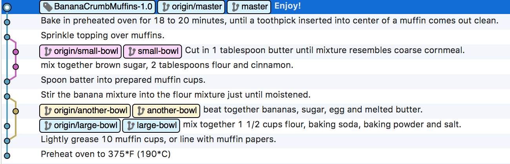
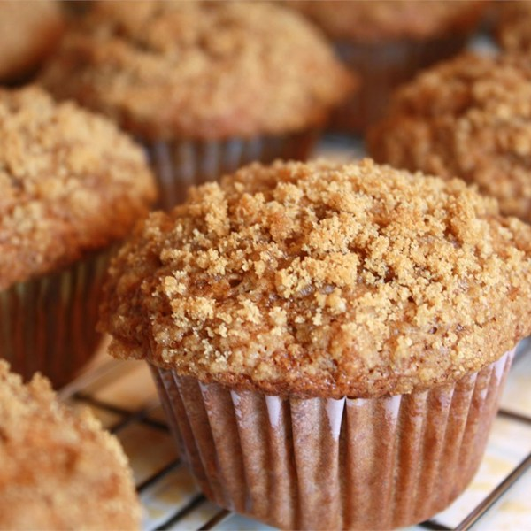

# Recipe for Banana Crumb Muffins

This is [the recipe for Banana Crumb Muffins](http://allrecipes.com/recipe/17652/banana-crumb-muffins/), laid out as a Git repository.
Just for fun.

* Each commit represent a step in the recipe.
* Each commit contain one file per ingredient that needs to be added to the recipe.
* A branch represent a bowl or any container, so everything that happens on a given branch is done in the same bowl.
* When branches merge, this means that you should put the content of one bowl into another.

----

